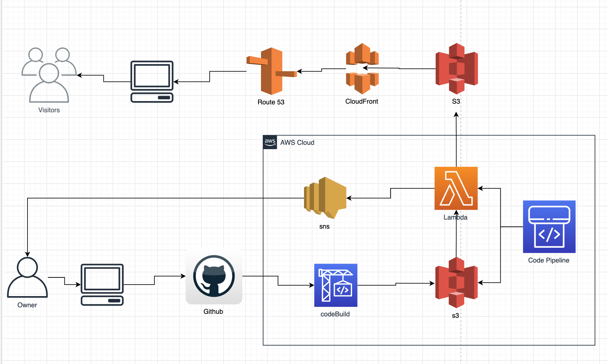

# Josh Neves Cloud Portfolio

This is my cloud portfolio page that is using AWS and react.

## Technologies used
- Git and GitHub
- SSH
- Brew
- HTML
- CSS
- Font Awesome
- Google Fonts

## To do list
- [x] Setup AWS CLI
- [x] Base HTML and CSS portfolio Page
- [x] AWS account
- [x] IAM roles
- [ ] Route 53 and DNS(need domain name)
- [x] Deploy S3
- [x] Add HTTPS to site 
- [x] CloudFront 
- [ ] AWS Lambda setup
- [ ] SNS setup
- [ ] Code Pipeline
- [ ] React component
